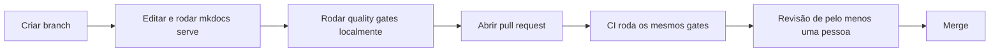

# Como contribuir

Este projeto trata documentação como código (**docs-as-code**): o conteúdo
vive em Markdown versionado no Git, passa por revisão em pull request e é
publicado automaticamente.

Se você é um agente de IA trabalhando neste repositório, leia também
[`AGENTS.md`](AGENTS.md): tem instruções mais diretas e verificáveis do que
este arquivo.

## Onde escrever cada coisa e como escrever

As normas de redação técnica deste projeto são, elas mesmas, documentação,
e seguem o próprio framework que recomendam. Antes de criar uma página nova,
leia:

- [Por que a documentação é organizada em quatro tipos](docs/contribuindo/diataxis.md): o raciocínio por trás da estrutura (Diátaxis).
- [Voz e tom](docs/contribuindo/voz-e-tom.md): a personalidade da escrita, com exemplos de antes e depois.
- [Como escrever uma página de documentação neste template](docs/contribuindo/como-escrever-documentacao.md): passo a passo prático.
- [Convenções de escrita](docs/contribuindo/convencoes-de-escrita.md): regras de estilo e formatação, para consulta rápida.

Essas regras ficam na aba `docs/contribuindo/`, separada dos quatro tipos de
conteúdo (`docs/documentacao/tutoriais/`, `docs/documentacao/guias-como-fazer/`, `docs/documentacao/referencia/`,
`docs/documentacao/explicacoes/`). `docs/contribuindo/` acompanha o template
permanentemente como guia de estilo vivo. Ajuste-o conforme as regras da
sua equipe.

Não misture os quatro tipos de documento na mesma página. Se um tutorial
precisa explicar uma decisão de design, linke para uma página de explicação
em vez de expandir o assunto ali.

## Quality gates

Antes de abrir o PR, rode localmente as mesmas verificações que o CI roda
(ver [Quality gates](docs/contribuindo/qualidade.md) para o que cada uma
verifica e por quê):

```bash
docker run --rm -v "$PWD:/work" -w /work node:24-alpine npm ci
docker run --rm -v "$PWD:/work" -w /work node:24-alpine npm run lint:md
docker run --rm -v "$PWD:/work" -w /work node:24-alpine npm run lint:spell
python3 scripts/check_tipografia.py
mkdocs build --strict
```

Se você já tem Node 24+ instalado, `npm ci && npm run lint` faz as duas
primeiras etapas de uma vez.

## Fluxo de contribuição



1. Crie uma branch a partir de `main`.
2. Rode a documentação localmente para conferir o resultado:

   ```bash
   pip install -r requirements.txt
   mkdocs serve
   ```

3. Rode os quality gates (seção acima).
4. Abra um pull request. O CI roda o mesmo build e os mesmos quality gates.
5. Peça revisão de pelo menos uma pessoa antes do merge.

## Mensagens de commit

Use [Conventional Commits](https://www.conventionalcommits.org/) no formato
`tipo(escopo): assunto`, com assunto no imperativo e sem ponto final. Tipos
usados neste projeto: `feat`, `fix`, `docs`, `style`, `refactor`, `chore`,
`ci`, `build`.

## Continue por aqui

- [`AGENTS.md`](AGENTS.md): instruções para agentes de IA.
- [`docs/contribuindo/index.md`](docs/contribuindo/index.md): o guia de
  estilo completo.
- [`README.md`](README.md): visão geral do template.
