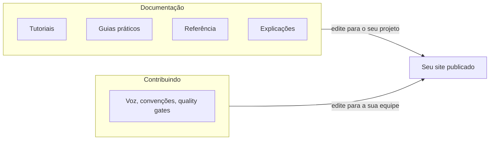

# Template de Documentação Técnica

[](https://github.com/guesant/template-documentacao-tecnica/actions/workflows/docs.yml)
[](https://github.com/guesant/template-documentacao-tecnica/actions/workflows/lint.yml)
[](https://guesant.github.io/template-documentacao-tecnica/)
[](LICENSE)

Template para começar um projeto de documentação técnica com docs-as-code.
Organizado segundo o framework [Diátaxis](docs/contribuindo/diataxis.md):
tutoriais, guias práticos, referência e explicações. Inclui
[quality gates](docs/contribuindo/qualidade.md) automatizados (lint,
ortografia, tipografia) e instruções prontas para agentes de IA
(`AGENTS.md`).

## Sumário

- [Estrutura](#estrutura)
- [Quality gates](#quality-gates)
- [Usando este template](#usando-este-template)
- [Continue por aqui](#continue-por-aqui)
- [Referências](#referências)
- [Licença](#licença)

## Estrutura



Todo o conteúdo do site fica na pasta `docs/`, dividida em duas pastas que
espelham as duas abas do site: `docs/documentacao/` e `docs/contribuindo/`.
Fora de `docs/` ficam a configuração do site, o fluxo de contribuição, as
instruções para agentes de IA, a configuração dos quality gates e os
workflows de CI e deploy.

O site tem duas abas, para separar quem lê de quem escreve:

- **Documentação** (`docs/documentacao/`): os quatro tipos do Diátaxis, já
  preenchidos com conteúdo real sobre como clonar, rodar, publicar e manter
  este próprio template. Substitua pelo conteúdo do seu projeto quando for
  usar o template para valer.
- **Contribuindo** (`docs/contribuindo/`): as regras de quem escreve. Por
  que a estrutura é assim, voz e tom, convenções de escrita, quality
  gates. Essa aba acompanha o template permanentemente. É o guia de estilo
  vivo da sua documentação. Edite-a para as regras da sua equipe em vez de
  removê-la.

A navegação real, a fonte da verdade sobre quais páginas existem e onde, é
a seção `nav` do `mkdocs.yml`.

## Quality gates

Quatro verificações automatizadas rodam em paralelo em CI a cada pull
request, detalhadas em [`docs/contribuindo/qualidade.md`](docs/contribuindo/qualidade.md):

- Lint de estrutura Markdown, com [markdownlint](https://github.com/DavidAnson/markdownlint-cli2).
- Ortografia em português, com [cspell](https://cspell.org/) e um
  dicionário pt-BR.
- Um script próprio que bane emoji, caractere invisível, aspa tipográfica
  e qualquer caractere fora do alfabeto latino padrão de prosa técnica.
- Build estrito do site, para pegar link interno quebrado.

Rode tudo localmente com Docker, sem precisar instalar Node no seu
sistema:

```bash
docker run --rm -v "$PWD:/work" -w /work node:24-alpine npm ci
docker run --rm -v "$PWD:/work" -w /work node:24-alpine npm run lint
```

## Usando este template

Clique em Use this template no GitHub, ou clone diretamente:

```bash
git clone https://github.com/guesant/template-documentacao-tecnica.git meu-projeto-docs
cd meu-projeto-docs
rm -rf .git && git init
```

Depois, nesta ordem:

1. Ajuste o nome do site e a URL do repositório em `mkdocs.yml`.
2. Substitua o conteúdo de exemplo em cada pasta de `docs/documentacao/`.
3. Ajuste `docs/contribuindo/` às regras da sua equipe.
4. Rode localmente:

   ```bash
   pip install -r requirements.txt
   mkdocs serve
   ```

5. Habilite o GitHub Pages nas configurações do repositório: abra Settings,
   depois Pages, e mude Source para GitHub Actions. O workflow já publica
   a cada push na branch principal.
6. O Dependabot já está configurado para manter npm, pip e as GitHub
   Actions atualizados semanalmente.

## Continue por aqui

- Vai adotar o template? Comece pelo tutorial em `docs/documentacao/tutoriais/index.md`
  (ou pela versão publicada, se o site já estiver no ar).
- Vai contribuir com este repositório? Leia [`CONTRIBUTING.md`](CONTRIBUTING.md)
  e [`AGENTS.md`](AGENTS.md).

## Referências

- [Diátaxis](https://diataxis.fr/)

## Licença

[The Unlicense](https://unlicense.org/): domínio público. Sem direitos
reservados, sem exigência de atribuição, use como quiser. Texto completo
em [`LICENSE`](LICENSE).
