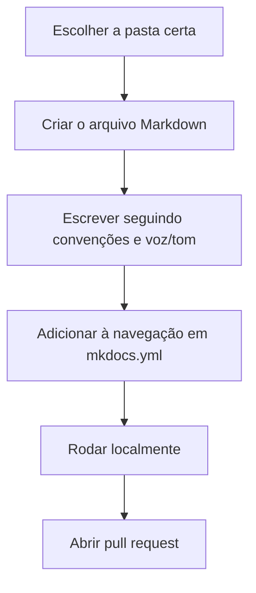

# Como escrever uma página de documentação neste template

Este guia mostra o passo a passo para adicionar uma página nova seguindo as
normas do projeto.

## Pré-condições

- Você já sabe qual **tipo** de documento vai escrever. Se não sabe, veja
  primeiro [por que a documentação é organizada em quatro tipos](diataxis.md).

## Passos



1. **Escolha a pasta certa** conforme o tipo de conteúdo:

    | Se o texto... | Vai em |
    |---|---|
    | ensina do zero, passo a passo | `docs/documentacao/tutoriais/` |
    | resolve um problema específico de quem já conhece o projeto | `docs/documentacao/guias-como-fazer/` |
    | descreve algo com precisão técnica, para consulta | `docs/documentacao/referencia/` |
    | discute o porquê, contexto ou decisão de design | `docs/documentacao/explicacoes/` |

2. **Crie o arquivo Markdown** com nome em minúsculas e hífens
   (ex.: `configurar-autenticacao.md`).

3. **Escreva seguindo as [convenções de escrita](convencoes-de-escrita.md)**
   (título, formatação, terminologia) e a [voz e tom](voz-e-tom.md) esperados.
   Se for a primeira vez escrevendo o tipo de página escolhido, considere
   partir de um template estrutural do
   [The Good Docs Project](referencias.md#good-docs-project), adaptado às
   convenções deste projeto.

4. **Adicione a página à navegação** em `mkdocs.yml`, na seção correspondente.

5. **Rode localmente** para revisar o resultado renderizado:

    ```bash
    pip install -r requirements.txt
    mkdocs serve
    ```

6. **Abra um pull request.** Veja o fluxo completo em
   [`CONTRIBUTING.md`](https://github.com/guesant/template-documentacao-tecnica/blob/main/CONTRIBUTING.md).

## Verificando o resultado

Depois de publicado, confirme que:

- a página aparece no menu de navegação.
- os links internos funcionam (`mkdocs build --strict` falha se houver link quebrado).
- o tipo de conteúdo está de fato na pasta certa. Se você misturou explicação
  dentro de um guia prático, considere separar em duas páginas.

## Checklist de autorrevisão

Checklist curto antes de abrir o PR, consolidando as regras DEVE de
[Convenções de escrita](convencoes-de-escrita.md), prática de revisão
recorrente em guias como o do [Write the Docs](referencias.md#write-the-docs)
e do [GitLab](referencias.md#gitlab-style):

- [ ] A página tem um único `h1` e um único tipo de conteúdo (Diátaxis).
- [ ] As instruções estão em segunda pessoa, imperativo, voz ativa.
- [ ] Todo bloco de código foi executado e funciona como está escrito.
- [ ] Todo link interno é relativo e resolve (`mkdocs build --strict` passa).
- [ ] Nenhum dado sensível real aparece em exemplos.
- [ ] Nenhum TODO ou rascunho ficou no texto publicado.
- [ ] A página foi adicionada à navegação em `mkdocs.yml`.

## Continue por aqui

- Próximo passo: [Quality gates](qualidade.md), para rodar essas
  verificações antes de abrir o PR.
- [Voltar a Contribuindo](index.md).
