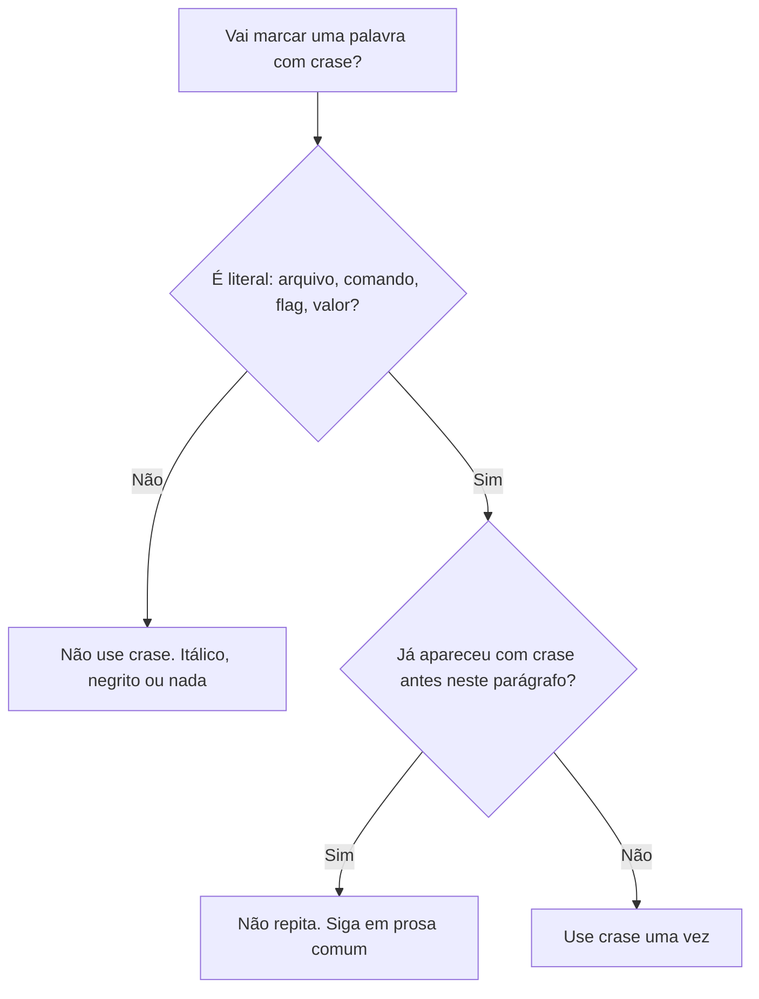
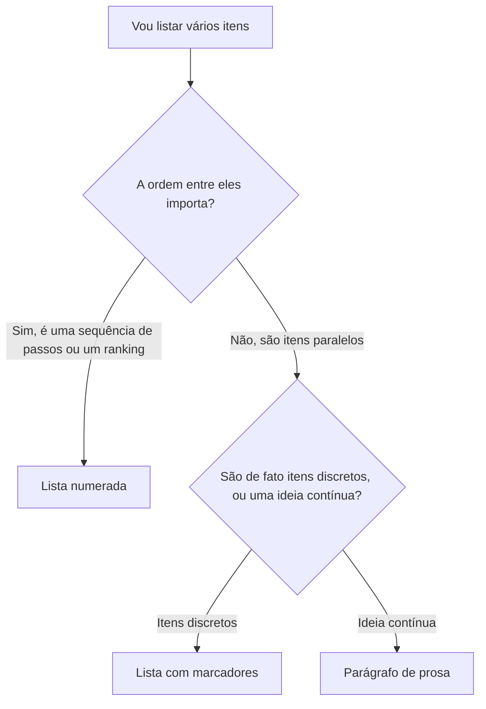

# Convenções de escrita

Referência das regras de estilo e formatação usadas em toda a documentação
deste template. Cada regra cita a fonte de onde vem. A lista completa está em
[Referências](referencias.md). Para princípios de personalidade e tom, veja
[Voz e tom](voz-e-tom.md). Esta página trata do que é objetivamente
verificável: gramática, pontuação, estrutura, formatação, terminologia.

<a id="escopo"></a>

**Escopo: todo arquivo `.md` deste repositório, não só `docs/`.** Estas
regras (voz, pontuação banida, crase, listas, links) valem para
`README.md`, `CONTRIBUTING.md` e `AGENTS.md` (e seus symlinks `CLAUDE.md`
e `GEMINI.md`) exatamente como valem para qualquer página em `docs/`. Não
existe zona informal onde travessão ou crase em excesso ficam de fora só
porque o arquivo está fora de `docs/`. O [checker de tipografia](qualidade.md)
já escaneia `README.md`, `CONTRIBUTING.md` e `AGENTS.md` junto com
`docs/**/*.md`. Regras de conteúdo que dependem de contexto (crase só
para literal, links liberais, lista só quando a ordem importa) não são
verificadas automaticamente fora de `docs/`, mas continuam DEVE.



<a id="niveis-de-obrigatoriedade"></a>

## Níveis de obrigatoriedade

Para não deixar ambíguo o que é regra e o que é sugestão, esta seção adota o
vocabulário de [RFC 2119](referencias.md#rfc2119) (Bradner, 1997), traduzido
para português na convenção comum em documentos normativos técnicos. O
esclarecimento de [RFC 8174](referencias.md#rfc8174) (Leiba, 2017) também se
aplica: só as palavras em **maiúsculas** carregam o significado normativo.

| Palavra-chave | Significado |
|---|---|
| **DEVE** / **É OBRIGATÓRIO** | Requisito absoluto. Uma página que viola isso não deve ser mesclada. |
| **NÃO DEVE** | Proibição absoluta. |
| **DEVERIA** / **RECOMENDA-SE** | Forte recomendação. Ignorar exige justificativa explícita no PR. |
| **NÃO DEVERIA** | Forte desaconselhamento, mesma lógica acima. |
| **PODE** | Opcional, a critério de quem escreve. |

As regras abaixo usam esse vocabulário explicitamente sempre que a
obrigatoriedade não for óbvia pelo contexto.

## Idioma, pessoa e tempo verbal

| Regra | Detalhe | Obrigatoriedade |
|---|---|---|
| Idioma | Português (pt-BR) | DEVE |
| Pessoa gramatical | Segunda pessoa ("você"), nunca terceira pessoa distante ("o usuário") | DEVE |
| Voz | Ativa, não passiva ("o comando gera" em vez de "é gerado pelo comando") | DEVERIA |
| Tempo verbal em instruções | Imperativo direto ("execute", "abra") | DEVE |
| Frases | Curtas, uma ideia principal por frase | DEVERIA |

A preferência por segunda pessoa, imperativo e voz ativa aparece de forma
convergente no [Google Developer Documentation Style Guide](referencias.md#google-style),
no [Microsoft Writing Style Guide](referencias.md#microsoft-style) e nas
[Plain Language Guidelines](referencias.md#plain-language). Não é
peculiaridade deste template: é o denominador comum entre guias de estilo de
documentação técnica em português e inglês.

## Pontuação

<a id="pontuacao-banida"></a>

**Travessão, meia-risca e seta são banidos, sem exceção.** Não é uma
questão de moderação, é proibição total. Nenhuma página deste template usa
travessão (o traço longo de separação de frase, U+2014), meia-risca (o
traço de intervalo, U+2013) ou seta (U+2192, U+2190, U+2194) em nenhuma
circunstância, nem em citação, nem em exemplo, nem em paráfrase de outra
fonte.

- NÃO DEVE haver travessão, meia-risca ou seta em nenhum arquivo Markdown
  do projeto. Reescreva com ponto final, vírgula ou dois-pontos.
- Para indicar sequência de passos em uma interface (por exemplo, "abra
  Configurações, depois Geral"), use vírgula ou liste os passos numerados.
  Não use seta.
- Para intervalo numérico, escreva por extenso ("de 2019 a 2020"), não use
  meia-risca.
- O [quality gate de tipografia](qualidade.md) rejeita automaticamente
  qualquer um dos três, em qualquer página.

**Ponto e vírgula: também banido.** Quase sempre está juntando duas
orações que deveriam ser duas frases separadas por ponto final. Poucas
pessoas escrevem documentação técnica em português usando ponto e vírgula
com naturalidade, e forçar a leitura a parar numa pontuação incomum
atrapalha mais do que ajuda. NÃO DEVE haver ponto e vírgula em texto
corrido. Se a lista de itens já usa vírgula internamente e parece
confusa, transforme em lista com marcadores em vez de espremer tudo numa
frase só. Dentro de bloco de código o ponto e vírgula continua permitido
normalmente, é sintaxe real de várias linguagens.

**Reticências: só como três pontos digitados, nunca como caractere
único.** Digite `...` (três pontos separados). Não use o glifo único de
reticências: a maioria dos teclados no Brasil não tem essa tecla, e ele
aparece sobretudo por autocorreção de editor de texto ou por geração
automática de texto. O [quality gate de tipografia](qualidade.md) rejeita
o glifo único automaticamente.

**Aspas retas, não tipográficas.** Use `"..."` e `'...'`, não a versão
curva dessas mesmas aspas. Aspas retas copiam e colam sem quebrar em
terminais e blocos de código. É o motivo prático por trás da preferência,
não uma questão estética. O [quality gate de tipografia](qualidade.md)
garante isso automaticamente.

<a id="uso-de-codigo-inline"></a>

**Código inline (crase) só para literais, com moderação mesmo aí.** Use
crase para nome de arquivo, comando, flag, chave de configuração, valor
literal ou identificador de código, nunca para dar destaque a uma palavra
comum só porque ela soa técnica. Se a palavra não é algo que alguém
digitaria literalmente num terminal ou num arquivo de configuração, ela
não leva crase. Use itálico, negrito ou nenhuma marcação para ênfase.

Além disso, DEVERIA evitar repetir o mesmo caminho ou comando entre crases
várias vezes seguidas no mesmo parágrafo. Nomeie o arquivo ou comando uma
vez com crase e siga o resto do parágrafo em prosa comum, referindo-se a
ele por nome, sem marcação. Um parágrafo onde quase todo substantivo está
entre crases lê pior do que um parágrafo sem nenhuma, mesmo quando cada
crase individual está tecnicamente correta. É o mesmo problema do
travessão: densidade constante de marcação sinaliza descuido, não
precisão.

## Estrutura de página

| Regra | Detalhe | Obrigatoriedade |
|---|---|---|
| Um assunto por página | Se o título precisa de "e" para descrever o conteúdo, considere dividir | DEVERIA |
| Título | `# Título` único por página (`h1`), descreve o conteúdo sem ambiguidade | DEVE |
| Hierarquia de seções | Sem pular nível (não ir de `##` direto para `####`) | DEVE |
| Nome de arquivo | Minúsculas, hífen como separador, sem acentos (ex.: `configurar-ci.md`) | DEVE |
| Tipo único de conteúdo | Uma página não mistura tutorial, guia, referência e explicação. Ver [Diátaxis](diataxis.md) | DEVE |

Misturar tipos de conteúdo é, segundo a própria origem do framework, a causa
mais comum de documentação confusa (paráfrase de
[Diátaxis](referencias.md#diataxis)). Um "tutorial" cheio de ramificações
condicionais é, na prática, um guia prático disfarçado.

## Formatação

| Situação | Use | Obrigatoriedade |
|---|---|---|
| Sequência de passos | Lista numerada | DEVE |
| Dados comparáveis / tabulares | Tabela | DEVERIA |
| Comando a ser executado | Bloco de código com a linguagem/shell identificada | DEVE |
| Termo técnico na primeira ocorrência | Link para a página de referência que o define | DEVERIA |
| Aviso importante | Bloco `!!! warning` (admonition do MkDocs Material) | DEVERIA |
| Passo opcional dentro de um fluxo | Bloco `!!! note` ou texto explícito "(opcional)" | DEVE |
| Emoji | Nunca. Ver [Quality gates](qualidade.md#emojis) | NÃO DEVE |

<a id="listas-vs-prosa"></a>

**Lista numerada só quando a ordem importa de verdade.** Uma lista
numerada afirma implicitamente "faça 1, depois 2, depois 3" ou "isto está
ranqueado". Se os itens não dependem da ordem entre si (são fatos
paralelos, opções independentes, ou peças de uma mesma ideia), a lista
numerada está mentindo sobre a estrutura do conteúdo.



- DEVE usar lista numerada só para: passo a passo onde cada item depende
  do anterior, ou itens explicitamente ranqueados (ex.: "em ordem de
  gravidade").
- NÃO DEVE usar lista numerada para enumerar checagens, ferramentas ou
  fatos que ocorrem em paralelo ou não têm relação de dependência entre
  si, mesmo que sejam "quatro coisas". Use lista com marcadores.
- NÃO DEVE fragmentar em lista (numerada ou com marcadores) o que é, na
  prática, uma única ideia contínua com duas ou três frases relacionadas.
  Escreva um parágrafo. Lista curta demais vira ruído visual, não ajuda a
  escanear nada.
- Título de seção numerado (`## 1. Nome`) só é aceitável quando os itens
  realmente são consultados por número (ex.: "veja a verificação 2"). Se
  as seções descrevem coisas paralelas, use títulos sem número.

**Tamanho da lista, ordenada ou não.** DEVERIA ter no máximo sete itens.
O [Microsoft Writing Style Guide](referencias.md#microsoft-style) recomenda
entre dois e sete itens por lista, com cada item curto o bastante para
quem lê enxergar dois ou três de uma vez, e trata mais de um parágrafo por
item como exceção rara. Se a lista naturalmente passa de sete itens,
DEVERIA agrupar em subseções com título próprio, ou reescrever como
parágrafo de prosa com frase de introdução, prática também recomendada
pelo [GOV.UK Style guide](referencias.md#gov-uk) para listas muito longas.
Uma lista de doze itens não fica mais escaneável só por ter marcadores:
fica um bloco de texto disfarçado de lista.

## Terminologia

- Cada termo técnico específico do projeto DEVE ter uma definição única em
  `docs/documentacao/referencia/`. Se duas páginas definem o mesmo termo de formas
  diferentes, isso é um bug de documentação, não uma questão de estilo.
- Um glossário centralizado é recomendado. O [Google Developer Documentation
  Style Guide](referencias.md#google-style) e o [Kubernetes Documentation
  Style Guide](referencias.md#k8s-style) sugerem manter um único ponto de
  verdade para nomes de conceitos, evitando sinônimos concorrentes para a
  mesma coisa.
- Use sempre o mesmo termo para o mesmo conceito ao longo de toda a
  documentação. Não alterne "usuário", "pessoa usuária" e "cliente" para a
  mesma entidade sem motivo.
- Siglas DEVEM ser expandidas por extenso na primeira ocorrência de cada
  página, mesmo que já tenham aparecido em outra.

## Acessibilidade e inclusão

- Texto alternativo (`alt`) DEVE ser escrito para toda imagem que carregue
  informação (não decorativa).
- Links NÃO DEVEM usar texto genérico como "clique aqui". O texto do link
  DEVE descrever o destino, prática recomendada tanto pelo
  [Google Developer Documentation Style Guide](referencias.md#google-style)
  quanto pelo [GOV.UK Style guide](referencias.md#gov-uk), por afetar
  diretamente leitores de tela.
- Linguagem inclusiva e livre de viés DEVE ser usada. Evite termos que
  presumam gênero, capacidade física ou contexto cultural não universal,
  seguindo a orientação de bias-free communication do
  [Microsoft Writing Style Guide](referencias.md#microsoft-style).
- Prefira frases curtas e vocabulário comum a construções rebuscadas. Texto
  mais simples é mais acessível a leitores não nativos, a pessoas
  neurodivergentes e a ferramentas de tradução automática, argumento central
  das [Plain Language Guidelines](referencias.md#plain-language).

## Código de exemplo

- Todo bloco de código DEVE ser executável como está. Teste antes de
  commitar.
- Exemplos mínimos e reais são preferíveis a pseudocódigo (DEVERIA).
- A linguagem do bloco DEVE ser identificada (` ```bash `, ` ```yaml `, etc.),
  tanto para realce de sintaxe quanto para leitores de tela.
- Placeholders em exemplos DEVEM seguir um padrão visualmente óbvio (ex.:
  `<seu-token>`, `SEU_PROJETO`), nunca valores reais nem que pareçam reais.

## Links

- Links internos DEVEM ser relativos ao arquivo atual (ex.:
  `../documentacao/referencia/index.md`), não absolutos ao domínio publicado.
- `mkdocs build --strict` DEVE passar sem erros antes do merge. Ele falha
  o build se houver link interno quebrado.
- Links externos para fontes citadas DEVEM apontar para a origem primária
  (documentação oficial, RFC, especificação), não para resumos de terceiros.

<a id="links-liberais"></a>

**Linke sem medo, no estilo Wikipédia.** O
[manual de estilo da Wikipédia sobre links](referencias.md#wikipedia-linking)
recomenda linkar a primeira ocorrência de um termo relevante direto na
frase onde ele aparece, não só numa lista de links ao final da página.
Este template adota a mesma prática:

- DEVERIA haver link na primeira menção de qualquer termo, página ou
  conceito deste projeto que tenha sua própria página, mesmo no meio de
  uma frase de prosa comum. Não espere chegar numa seção "Continue por
  aqui" para linkar algo que já foi mencionado três parágrafos antes.
- Um parágrafo com vários links não é ruído. É o oposto de crase em
  excesso: aqui, mais é melhor, porque cada link é uma porta de saída real
  para quem quer aprofundar, não uma marcação decorativa.
- NÃO DEVE repetir o link para o mesmo alvo mais de uma vez dentro da
  mesma seção curta. Linke na primeira ocorrência da seção, depois
  mencione o termo em prosa comum.
- Toda página DEVE terminar com uma seção "Continue por aqui" apontando
  o próximo passo lógico no fluxo de leitura, além dos links já linkados
  ao longo do texto.

## O que é permitido

- PODE haver opinião e comparação de alternativas em páginas de
  [Explicação](../documentacao/explicacoes/index.md). É o único tipo de conteúdo em que
  isso é esperado.
- PODE haver reformulação de uma regra desta página para o contexto
  específico de um projeto que adote este template. Ver
  [Contribuindo](index.md).
- PODE haver mais de um exemplo de código por página quando ilustram
  variações relevantes (ex.: dois shells diferentes).

## O que não é permitido

- NÃO DEVE haver TODOs ou rascunhos em conteúdo publicado na branch `main`.
  Use branch/PR de rascunho até o texto estar pronto.
- NÃO DEVE haver duplicação de conteúdo entre páginas. Prefira linkar para
  a fonte única (princípio DRY aplicado à documentação, defendido também
  pelo [GitLab Documentation Style Guide](referencias.md#gitlab-style)).
- NÃO DEVE haver mistura de tipos de conteúdo Diátaxis na mesma página.
- NÃO DEVE haver captura de tela ou trecho de código com dado sensível real
  (token, senha, PII), nem mesmo "para depois trocar".
- NÃO DEVE haver link "clique aqui" ou equivalente sem valor descritivo.
- NÃO DEVE haver emoji em nenhum conteúdo publicado.
- NÃO DEVE haver caractere invisível, aspa tipográfica ou caractere fora do
  alfabeto latino padrão de prosa em português técnico. Ver
  [Quality gates](qualidade.md).

## Continue por aqui

- Próximo passo: [Como escrever uma página de documentação](como-escrever-documentacao.md).
- [Voz e tom](voz-e-tom.md)
- [Por que a documentação é organizada em quatro tipos](diataxis.md)
- [Quality gates: como essas regras são verificadas automaticamente](qualidade.md)
- [Referências](referencias.md)
- [Voltar a Contribuindo](index.md)
