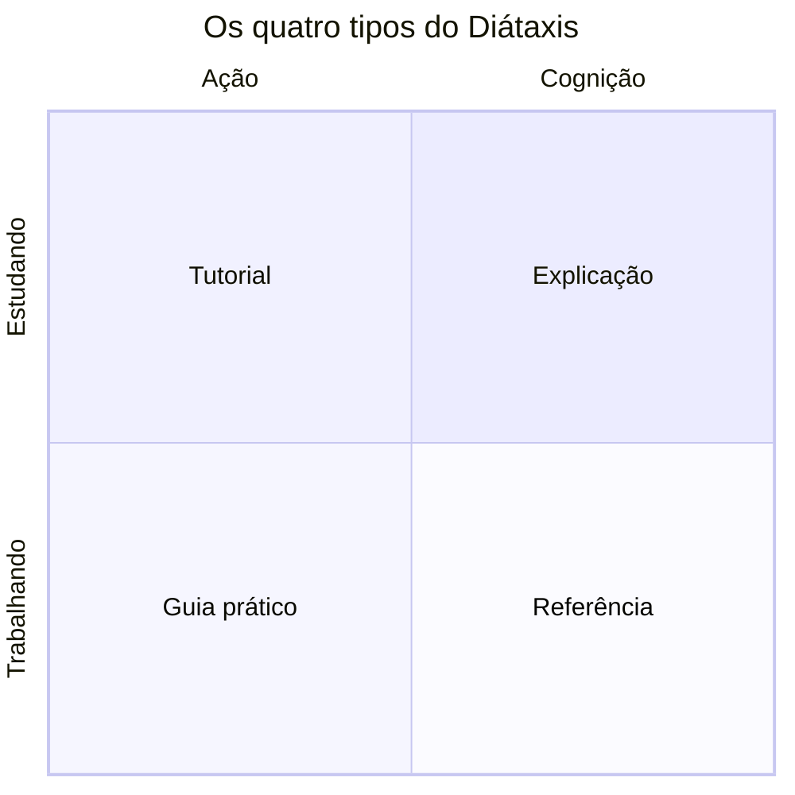

# Por que a documentação está organizada em quatro tipos

Este template usa o [Diátaxis](referencias.md#diataxis) (Procida), um
framework criado a partir da observação de que boa documentação técnica
sempre serve a uma de quatro necessidades diferentes. Misturar essas
necessidades na mesma página é a causa mais comum de documentação confusa.
O framework nasceu como o sistema de documentação da Divio antes de ser
formalizado de modo independente em [diataxis.fr](https://diataxis.fr/).

## As duas dimensões

O Diátaxis cruza duas perguntas:

- A pessoa está **estudando** (quer aprender) ou **trabalhando** (quer
  resolver algo agora)?
- Ela precisa de **ação** (fazer algo) ou de **cognição** (entender algo)?

|  | Ação | Cognição |
|---|---|---|
| **Estudando** | Tutorial | Explicação |
| **Trabalhando** | Guia prático | Referência |

Cada quadrante tem uma forma de escrita diferente, e forçar o conteúdo de um
quadrante na forma de outro é o que produz, por exemplo, um "tutorial" cheio
de ramificações condicionais (na verdade um guia prático mal disfarçado) ou
uma referência de API com parágrafos de motivação (na verdade uma explicação
perdida no lugar errado).

## Por que isso importa na prática

- **Quem escreve** sabe onde colocar cada conteúdo novo, sem debate a cada PR.
- **Quem lê** sabe o que esperar de cada seção: não precisa varrer um
  tutorial gigante para achar um detalhe de referência.
- **A manutenção fica mais fácil.** Referência muda quando o comportamento
  muda. Tutoriais e guias mudam raramente. Explicações quase nunca mudam.

Essa divisão não é uma peculiaridade deste template. O
[Google Developer Documentation Style Guide](referencias.md#google-style)
recomenda separar conteúdo conceitual de conteúdo procedimental pelo mesmo
motivo: misturar "o que é" com "como fazer" obriga quem só quer o comando a
ler contexto que não pediu, e quem quer entender o conceito a pular blocos
de comando irrelevantes. O [Kubernetes Documentation Style Guide](referencias.md#k8s-style)
adota uma separação equivalente entre conceitos, tarefas e referência. A
própria documentação do [Django](referencias.md#django-docs), um projeto
open source de grande porte fora do ecossistema da Divio, explica
publicamente sua estrutura em termos muito próximos aos quatro tipos do
Diátaxis, o que sugere que a divisão captura algo real sobre como
documentação técnica é lida, não apenas uma preferência estética de um
framework específico.

## Como isso se aplica neste template

- [`docs/documentacao/tutoriais/`](../documentacao/tutoriais/index.md): passo a passo, do zero a um resultado.
- [`docs/documentacao/guias-como-fazer/`](../documentacao/guias-como-fazer/index.md): solução para um problema específico.
- [`docs/documentacao/referencia/`](../documentacao/referencia/index.md): descrição técnica precisa, para consulta.
- [`docs/documentacao/explicacoes/`](../documentacao/explicacoes/index.md): contexto e decisões, como esta própria página.

Veja o [guia de como escrever uma página nova](como-escrever-documentacao.md)
para aplicar isso na prática, a [referência de convenções de escrita](convencoes-de-escrita.md)
para o estilo esperado, e [Voz e tom](voz-e-tom.md) para a personalidade da
escrita.

## Referências

Ver a lista completa e as fontes primárias em [Referências](referencias.md#diataxis).

## Continue por aqui

- Próximo passo: [Voz e tom](voz-e-tom.md).
- [Voltar a Contribuindo](index.md).
