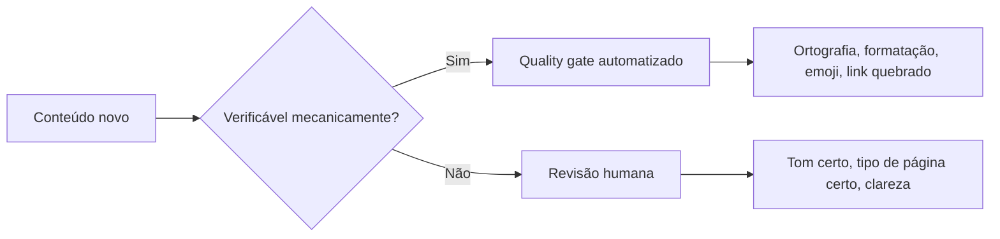

# Por que este template é construído assim

Este template toma algumas decisões de design que não são óbvias à
primeira vista. Esta página explica o raciocínio por trás delas, para quem
quer entender antes de adaptar.

## Por que MkDocs Material, e não outra ferramenta

[MkDocs Material](https://squidfunk.github.io/mkdocs-material/) foi
escolhido por três razões concretas, não por popularidade:

- Gera um site estático a partir de Markdown puro, sem exigir componente
  próprio de conteúdo, ao contrário do [Docusaurus](https://docusaurus.io/),
  que usa MDX e React.
- Tem busca full-text embutida, sem depender de serviço externo.
- Modo escuro e modo claro já vêm prontos, sem CSS adicional.

O custo é menos flexibilidade visual do que uma ferramenta baseada em
componentes React permitiria. Para um template cujo objetivo é
documentação técnica de texto corrido, esse custo vale a troca.

## Por que quality gates automatizados, e não só revisão humana

Regra que depende só de memória em revisão de PR degrada com o tempo:
quem revisa cansa, colaboradores novos não conhecem a norma implícita,
exceções acumuladas viram o novo normal. Automatizar o que é
mecanicamente verificável libera a revisão humana para o que só um humano
julga.

Mais detalhes em [Quality gates](../../contribuindo/qualidade.md).

## Por que `docs/contribuindo/` é permanente, não removível

A tentação natural ao adotar um template é apagar tudo que parece
"meta" e ficar só com o conteúdo do projeto. A decisão deste template foi
o oposto: as regras de escrita ficam, porque um projeto de documentação
sem guia de estilo explícito tende a divergir de voz entre quem escreve
cada página, silenciosamente, sem que ninguém perceba até o site já estar
grande e inconsistente. Ajustar as regras existentes custa muito menos do
que reconstruí-las do zero depois que a inconsistência já se instalou.

## Por que citar fontes em `docs/contribuindo/referencias.md`

Ver a página completa em [Referências](../../contribuindo/referencias.md).
Um guia de estilo sem fonte declarada é, na prática, opinião pessoal de
quem escreveu naquele dia, difícil de defender quando alguém discorda. Um
guia de estilo com cada regra rastreável a um framework ou guia
estabelecido ([Diátaxis](../../contribuindo/diataxis.md),
[Google](../../contribuindo/referencias.md#google-style),
[Microsoft](../../contribuindo/referencias.md#microsoft-style),
[GitLab](../../contribuindo/referencias.md#gitlab-style),
[RFC 2119](../../contribuindo/referencias.md#rfc2119)) dá a quem discorda
algo concreto para debater: a fonte está errada, ou a aplicação da fonte a
este projeto está errada. Isso é mais produtivo do que debater gosto
pessoal.

## Continue por aqui

- [Por que a documentação é organizada em quatro tipos](../../contribuindo/diataxis.md)
- [Referências](../../contribuindo/referencias.md)
- [Voltar ao início](../../index.md)
