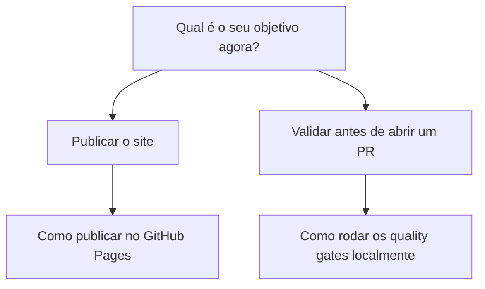

# Guias práticos

Guias práticos resolvem um problema específico de quem já tem alguma
familiaridade com o projeto e sabe o que precisa alcançar. Se você acabou
de clonar este template e ainda não rodou nada, comece pelo
[tutorial](../tutoriais/index.md) em vez desta seção.

## Guias disponíveis

- [Como publicar no GitHub Pages](publicar-no-github-pages.md): habilitar
  Pages, confirmar que o workflow de deploy está ativo, publicar.
- [Como rodar os quality gates localmente](rodar-quality-gates-localmente.md):
  markdownlint, cspell, checker de tipografia e `mkdocs build --strict`,
  antes de abrir um PR.

## Escrevendo o seu próprio guia

Ao substituir esses exemplos pelo conteúdo do seu projeto, cada guia novo
deve focar em um objetivo único e bem definido (ex.: "Como configurar
autenticação", não "Como configurar o sistema"). Regras completas em
[Como escrever uma página de documentação](../../contribuindo/como-escrever-documentacao.md).

## Continue por aqui

- Ainda não rodou o template? Volte para o [tutorial](../tutoriais/index.md).
- Precisa de um detalhe técnico exato? Veja a [referência](../referencia/index.md).
- [Voltar ao início](../../index.md).
