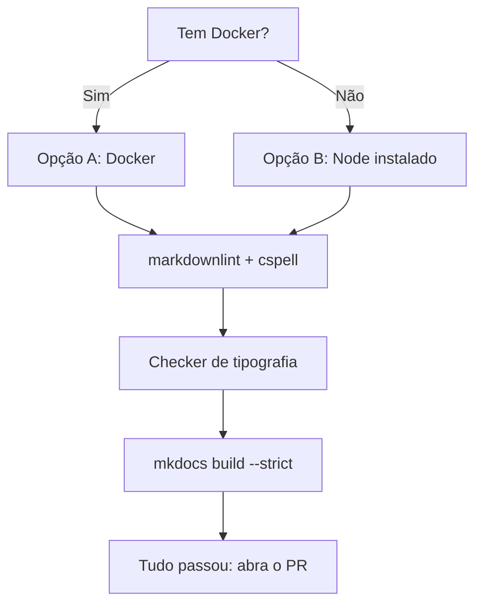

# Como rodar os quality gates localmente

Este guia mostra como rodar, na sua máquina, as mesmas quatro verificações
que o CI roda a cada pull request. Rodar localmente antes de abrir o PR
evita o ciclo de esperar o CI falhar, corrigir, esperar de novo.



## Pré-requisitos

- [Docker](https://www.docker.com/), se você quer rodar sem instalar Node
  no seu sistema (recomendado).
- Ou Node.js 24 ou mais recente, se preferir instalar direto.
- Python 3.9 ou mais recente (já necessário para o MkDocs).

## Opção A: com Docker, sem instalar Node

```bash
docker run --rm -v "$PWD:/work" -w /work node:24-alpine sh -c "npm ci && npm run lint"
```

Esse comando monta o repositório dentro de um container descartável,
instala as dependências de `package.json` e roda markdownlint e cspell em
sequência. Nada fica instalado na sua máquina depois que o container sai.

## Opção B: com Node instalado

```bash
npm ci
npm run lint
```

## Rode o checker de tipografia

Não depende de Node, roda direto com o Python do sistema:

```bash
python3 scripts/check_tipografia.py
```

## Rode a validação de build

```bash
pip install -r requirements.txt
mkdocs build --strict
```

## Interpretando falhas

| Ferramenta | Falha típica | Como corrigir |
|---|---|---|
| markdownlint | Cabeçalho sem linha em branco ao redor, lista mal numerada | O erro aponta arquivo, linha e regra (ex.: `MD022`). Ajuste a formatação apontada. |
| cspell | Palavra desconhecida | Se é erro de digitação, corrija o texto. Se é termo técnico legítimo (nome de ferramenta, sigla), adicione a `cspell-termos-do-projeto.txt`. |
| `check_tipografia.py` | Emoji, caractere invisível, aspa tipográfica | Remova o caractere apontado. O script imprime linha, coluna e o nome Unicode do caractere. |
| `mkdocs build --strict` | Link interno quebrado | Corrija o caminho relativo do link ou adicione a página que falta em `nav:` no `mkdocs.yml`. |

Detalhes de por que cada verificação existe estão em
[Quality gates](../../contribuindo/qualidade.md).

## Continue por aqui

- [Quality gates](../../contribuindo/qualidade.md): o que cada verificação
  pega e por quê.
- [Como publicar no GitHub Pages](publicar-no-github-pages.md): o próximo
  passo depois que os gates passam localmente.
- [Voltar aos guias práticos](index.md).
