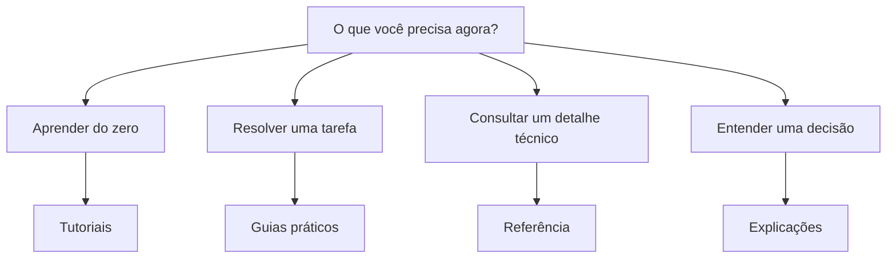

# Documentação

Esta pasta é onde o conteúdo do seu projeto vive: os quatro tipos do
[Diátaxis](../contribuindo/diataxis.md), já preenchidos com conteúdo real
sobre como operar este próprio template. Para as regras de como escrever
esse conteúdo, veja [Contribuindo](../contribuindo/index.md).

## Páginas

- [Tutoriais](tutoriais/index.md): aprender fazendo, do zero a um resultado.
- [Guias práticos](guias-como-fazer/index.md): resolver uma tarefa específica.
- [Referência](referencia/index.md): consulta técnica precisa.
- [Explicações](explicacoes/index.md): contexto e decisões de design.

## Continue por aqui

- Primeira vez aqui? Comece pelo [tutorial](tutoriais/index.md).
- [Voltar ao início](../index.md).
