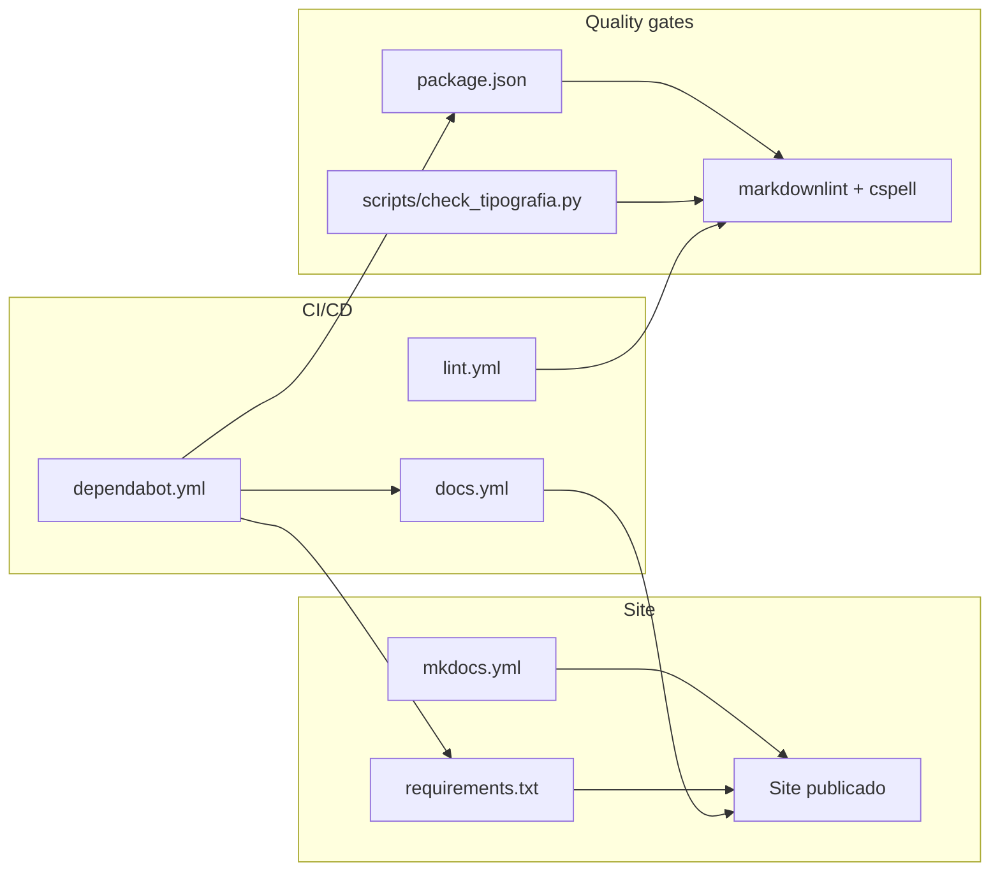

# Referência de configuração deste template

Descrição técnica precisa de cada arquivo de configuração deste template.
Para instruções passo a passo, veja os [guias práticos](../guias-como-fazer/index.md).
Esta página é para consulta, não para seguir do início ao fim.

## `mkdocs.yml`

| Campo | Tipo | Descrição |
|---|---|---|
| `site_name` | string | Nome exibido no topo do site e na aba do navegador. |
| `site_description` | string | Meta description da página, usada por buscadores. |
| `repo_url` | URL | Link "editar esta página" e ícone de repositório no topo. |
| `repo_name` | string | Texto exibido para `repo_url`. |
| `edit_uri` | caminho | Sufixo de URL usado para montar o link "editar esta página" de cada arquivo. |
| `theme.language` | string | Idioma da interface do tema (botões, busca). `pt-BR` neste template. |
| `theme.features` | lista | Recursos do Material ativados. Ver tabela abaixo. |
| `nav` | lista aninhada | Estrutura de navegação do site. Fonte da verdade de quais páginas existem e onde aparecem. |
| `markdown_extensions` | lista | Extensões de sintaxe Markdown habilitadas (admonition, blocos de código, TOC com âncoras). |
| `plugins` | lista | Plugins do MkDocs ativos. Só `search` neste template. |

### `theme.features` usados

| Feature | Efeito |
|---|---|
| `navigation.tabs` | Transforma itens de primeiro nível de `nav` em abas no topo (é o que separa Documentação de Contribuindo). |
| `navigation.sections` | Expande seções da barra lateral por padrão. |
| `navigation.top` | Adiciona botão "voltar ao topo". |
| `navigation.instant` | Navegação sem recarregar a página inteira. |
| `search.suggest` | Autocompletar na busca. |
| `search.highlight` | Destaca o termo buscado no resultado. |
| `content.action.edit` | Mostra o link "editar esta página" (usa `edit_uri`). |
| `content.code.copy` | Botão de copiar em blocos de código. |

## `requirements.txt`

Dependências Python para gerar o site. Uma única entrada:
`mkdocs-material>=9`, que já traz o MkDocs em si como dependência.

## `package.json`

Dependências Node para os [quality gates](../../contribuindo/qualidade.md) de
texto (não para gerar o site).

| Script | Comando | O que faz |
|---|---|---|
| `lint:md` | `markdownlint-cli2` | Lint de estrutura Markdown. |
| `lint:spell` | `cspell` | Ortografia em pt-BR. |
| `lint:tipografia` | `python3 scripts/check_tipografia.py` | Emoji, caractere invisível, aspa tipográfica. |
| `lint` | os três acima em sequência | Suíte completa, usada em CI. |

## Workflows de CI (`.github/workflows/`)

| Arquivo | Dispara em | Jobs |
|---|---|---|
| `docs.yml` | push/PR para `main` | `build` (mkdocs build --strict), `deploy` (GitHub Pages, só em `main`) |
| `lint.yml` | push/PR para `main` | `markdown-lint`, `spell-check`, `tipografia`, `mkdocs-build` |

## `.github/dependabot.yml`

O [Dependabot](https://docs.github.com/pt/code-security/dependabot) atualiza
automaticamente, semanalmente, em pull requests separados:

| Ecossistema | Diretório | Cobre |
|---|---|---|
| `npm` | `/` | `markdownlint-cli2`, `cspell`, `@cspell/dict-pt-br` |
| `pip` | `/` | `mkdocs-material` |
| `github-actions` | `/` | Versões das actions usadas em `.github/workflows/` |

## Versões de referência

Este template foi configurado com as versões abaixo. Pull requests do
Dependabot mantêm isso atualizado. Esta tabela pode ficar desatualizada
entre atualizações.

| Ferramenta | Versão de referência |
|---|---|
| Node.js (CI e Docker local) | 24 (LTS atual) |
| mkdocs-material | 9.x |
| markdownlint-cli2 | 0.23.x |
| cspell | 10.x |
| `actions/checkout` | v7 |
| `actions/setup-python` | v7 |
| `actions/setup-node` | v7 |
| `actions/deploy-pages` | v5 |

## Continue por aqui

- [Convenções de escrita](../../contribuindo/convencoes-de-escrita.md): regras
  de conteúdo, não de configuração.
- [Quality gates](../../contribuindo/qualidade.md): o que cada ferramenta
  desta página verifica e por quê.
- [Voltar ao início](../../index.md).
