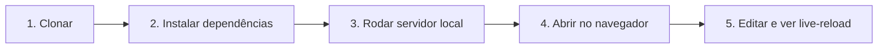

# Tutorial: clonar e rodar este template

Este tutorial leva você do zero a uma cópia deste site de documentação
rodando na sua máquina, com live-reload. Ao final, você terá um ambiente
local pronto para editar.

## Pré-requisitos

- Git instalado.
- Python 3.9 ou mais recente, com `pip`.

Nenhum outro pré-requisito. Você não precisa instalar Node nem MkDocs
globalmente antes de começar.



## Passo 1: obtenha uma cópia do repositório

Se você está adotando este template para um projeto novo, clique em
[Use this template](https://github.com/guesant/template-documentacao-tecnica/generate)
e crie o seu próprio repositório a partir dele. Depois clone o seu
repositório novo:

```bash
git clone https://github.com/SEU-USUARIO/SEU-REPOSITORIO.git
cd SEU-REPOSITORIO
```

Se você só quer experimentar este template sem criar um repositório
próprio ainda, clone-o diretamente:

```bash
git clone https://github.com/guesant/template-documentacao-tecnica.git
cd template-documentacao-tecnica
```

## Passo 2: instale as dependências do site

O site é gerado com [MkDocs Material](https://squidfunk.github.io/mkdocs-material/).
As dependências Python estão listadas em `requirements.txt`:

```bash
pip install -r requirements.txt
```

Você verá o `pip` instalar `mkdocs-material` e suas dependências. Isso leva
menos de um minuto na maioria das conexões.

## Passo 3: rode o servidor local

```bash
mkdocs serve
```

O terminal mostra uma linha parecida com:

```text
INFO    -  [HH:MM:SS] Serving on http://127.0.0.1:8000/
```

## Passo 4: abra o site no navegador

Acesse [http://127.0.0.1:8000/](http://127.0.0.1:8000/). Você verá a página
inicial deste template, com duas abas no topo: **Documentação** e
**Contribuindo**.

## Passo 5: edite uma página e veja o live-reload

Com o `mkdocs serve` ainda rodando, abra `docs/index.md` em um editor de
texto, mude qualquer frase e salve o arquivo. Volte ao navegador: a página
recarrega sozinha com a mudança, sem você precisar apertar nada.

Isso é o ciclo de trabalho deste template: editar Markdown em `docs/`, ver
o resultado imediatamente, revisar antes de commitar.

## O que você tem agora

Um site de documentação completo rodando localmente, com a estrutura
[Diátaxis](../../contribuindo/diataxis.md) já pronta e as regras de
escrita já documentadas em [Contribuindo](../../contribuindo/index.md).

## Continue por aqui

- Próximo passo: [Como publicar no GitHub Pages](../guias-como-fazer/publicar-no-github-pages.md).
- Vai escrever conteúdo? Leia [Como escrever uma página de documentação](../../contribuindo/como-escrever-documentacao.md).
- [Voltar ao início](../../index.md).
