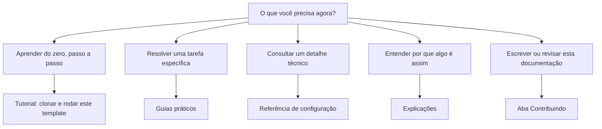

# Template de Documentação Técnica

Este é um template para projetos que querem tratar documentação como código
(**docs-as-code**), organizada segundo o framework [Diátaxis](https://diataxis.fr/).

## Por onde começar



## Como a documentação está organizada

O [Diátaxis](contribuindo/diataxis.md) divide a documentação em quatro
tipos, de acordo com a necessidade de quem lê:

| Tipo | Pergunta que responde | Pasta |
|---|---|---|
| [Tutoriais](documentacao/tutoriais/index.md) | "Me ensina, passo a passo" | `docs/documentacao/tutoriais/` |
| [Guias práticos](documentacao/guias-como-fazer/index.md) | "Como eu faço X?" | `docs/documentacao/guias-como-fazer/` |
| [Referência](documentacao/referencia/index.md) | "Quais são os detalhes técnicos de X?" | `docs/documentacao/referencia/` |
| [Explicações](documentacao/explicacoes/index.md) | "Por que X funciona assim?" | `docs/documentacao/explicacoes/` |

As quatro pastas acima são onde o conteúdo real do seu projeto vai morar.
Os arquivos de exemplo nelas devem ser substituídos.

A explicação de por que essa estrutura existe, como escrever uma página nova
e quais convenções seguir não fica misturada aos exemplos. Vive na aba
["Contribuindo"](contribuindo/index.md), separada da documentação em si,
como a maioria das ferramentas separa a visão de quem lê da visão de quem
contribui. Essa aba acompanha o template permanentemente: é o guia de estilo
vivo da sua documentação, para editar conforme o seu contexto, não para
apagar.

## Usando este template

1. Clique em **Use this template** no GitHub para criar um repositório novo a partir deste.
2. Ajuste o nome do site e a URL do repositório em `mkdocs.yml`.
3. Substitua os arquivos de exemplo em cada pasta pelo conteúdo real do seu projeto.
4. Ajuste a aba [Contribuindo](contribuindo/index.md) às regras da sua
   equipe. É o guia de estilo do seu projeto, não da ferramenta.
5. Rode a documentação localmente:

    ```bash
    pip install -r requirements.txt
    mkdocs serve
    ```

6. Publique no GitHub Pages: o workflow de deploy já faz o build e o
   publica automaticamente a cada push na branch principal.

## Continue por aqui

- Primeira vez com este template? Comece pelo
  [tutorial de clonar e rodar](documentacao/tutoriais/index.md).
- Já rodou o template e quer publicar ou validar antes de um PR? Veja os
  [guias práticos](documentacao/guias-como-fazer/index.md).
- Vai escrever conteúdo novo? Leia primeiro
  [Contribuindo](contribuindo/index.md).
